# Crowdsale ERC20 Tokens

#### Using Smart Contracts and OpenZeppelin to mint and crowdfund an ERC20 token within a 24 week timeframe. 
---
# Installs and Resources:

 [Remix - Smart Contract IDE](remix.ethereum.org)

 [My Crypto](mycrypto.com)

 [Open Zeppelin Docs](https://docs.openzeppelin.com/openzeppelin/)

 [MetaMask](https://metamask.io/)

---

## Using the Remix IDE you'll first want to setup your initial ERC20 Token:

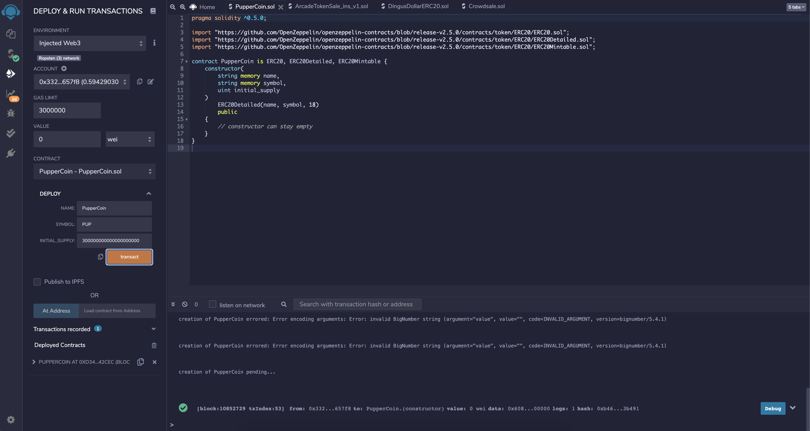

- Make sure to fill in the fields with the proper information relating to your ERC20. For this example I set the initial supply for 300,000,000,000,000,000,000 wei or 300 ETH. 

---

## Next, setup a separate file for your crowdsale like so:

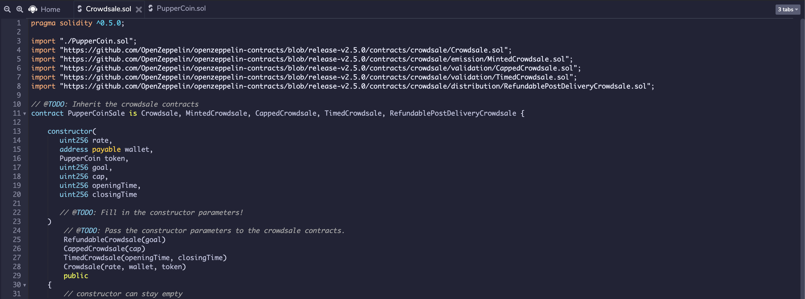

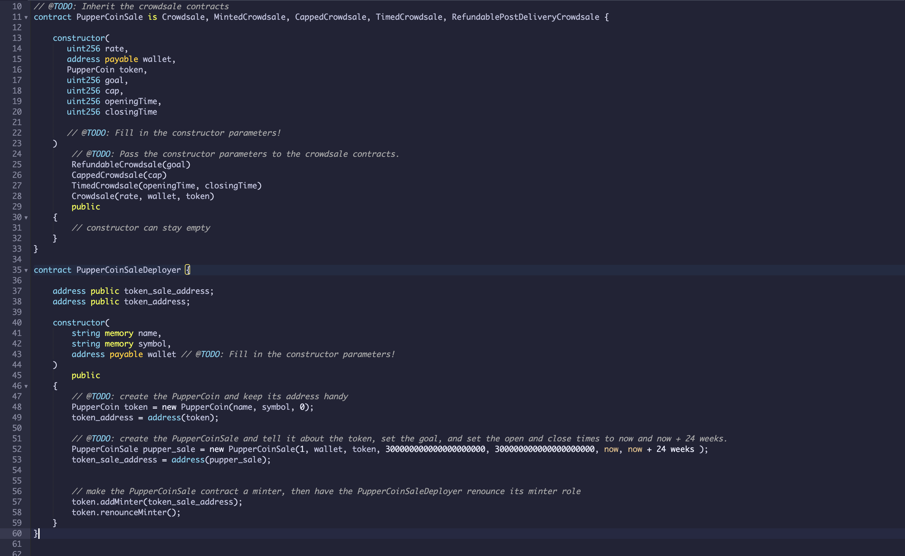

---

## Once both contracts are completed, compiled both of them and then make sure your "crowdsaledeployer" contract is selected like so: 

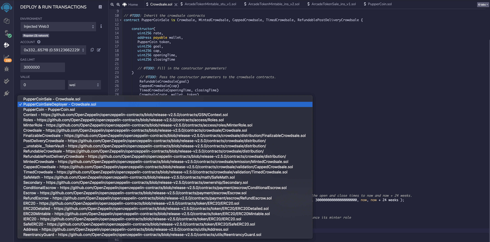

## Then, fill in your fields such as the name of the coin, symbol, and then the address you would like to use to pay for deploying the contract:

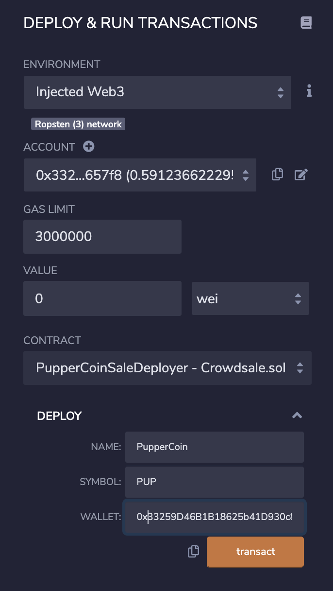

## Hit transact, then scroll down to your contracts and view your addresses like so:

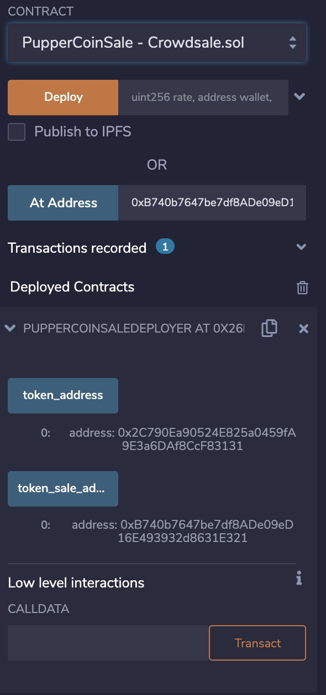

- Be sure to save both of these addresses in a text file 

- Access the sale by pasting the sale_address into the "At Address" field, make sure to select your sale contract right above where it says deploy before clicking "At Address"

## Then you should see a new contract was deployed: 

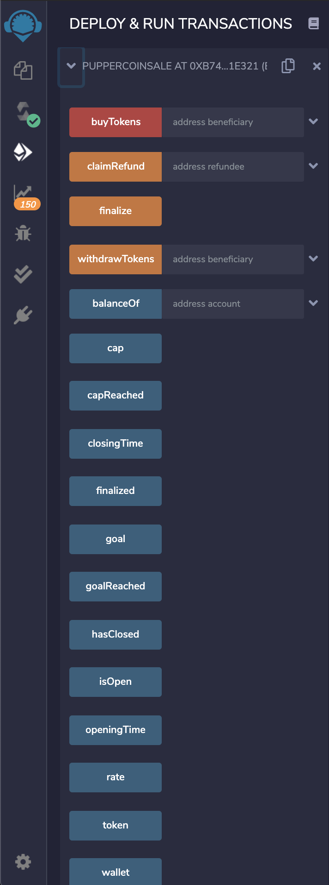

---

## Next, buy and mint some tokens by specifying how much in Wei in the "Value" field then by adding an address into the "beneficiary" field in your sale contract:
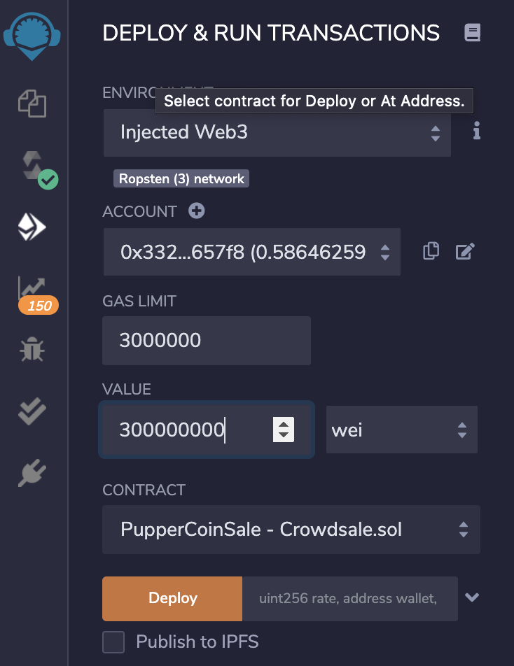
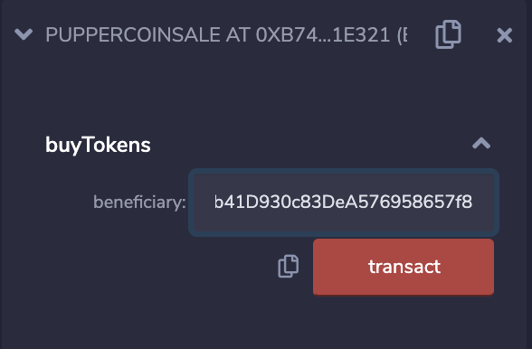

- This will then grant you tokens to the beneficiary address

## Metamask will then open up and you will need to confirm your transaction:

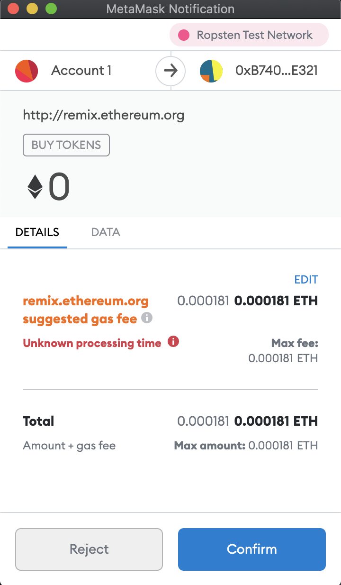

## You may not see you new ERC20 coin right away. You'll need to add it manually in Metamask like so:

- Open Metamask, go to Assets then scroll down and click "Add Token"

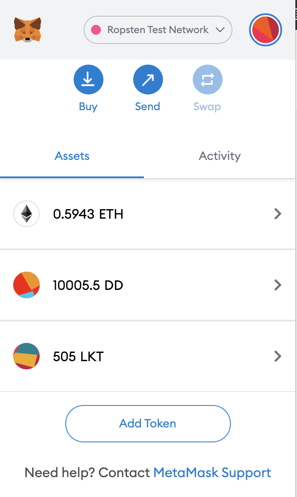

- Then fill in the following, you will need your token contract address to complete this, make sure you put your decimals in correctly as well. For mine I used 18, you can find this in the transaction details on Etherscan.io

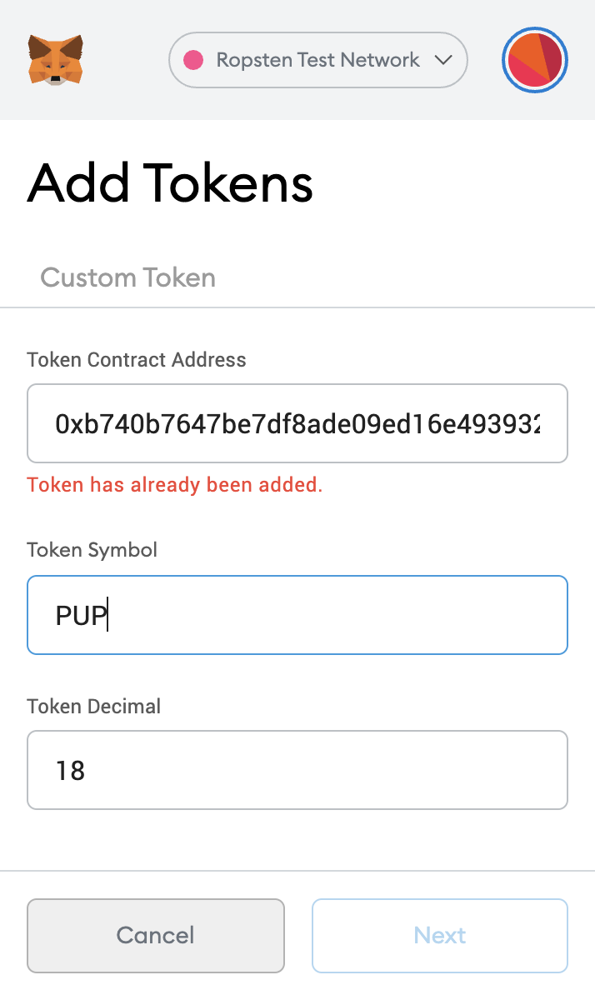

- Now you should see your balance of new tokens 

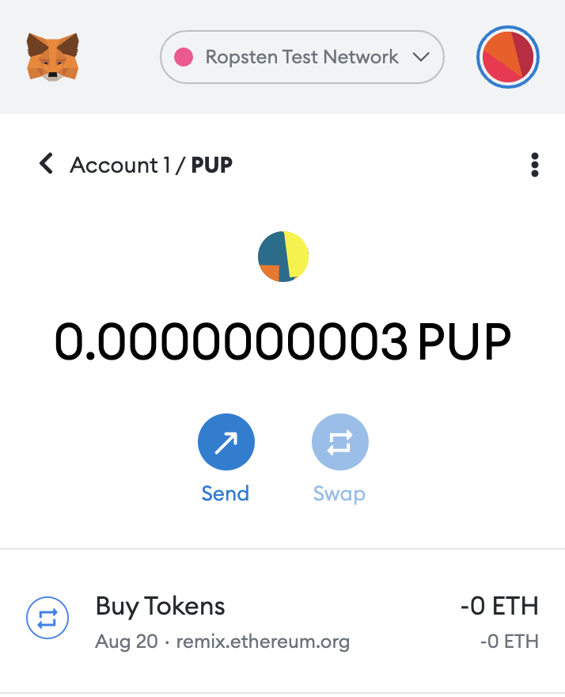

- You can also check your balance directly in Remix

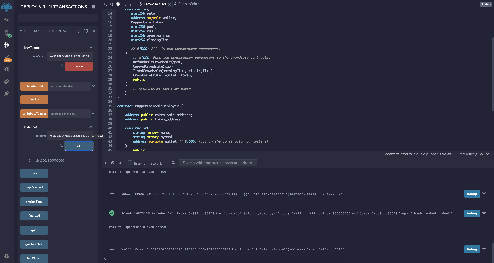

---

# Now you know how to crowdfund using Smart Contracts using ERC20 tokens! 

